# Cloud Run Debug Kit
This repository provides a kit for interactively testing and validating tools on Cloud Run.

Cloud Run does not provide interactive debugging methods like exec, debug commands as Kubernetes does. This kit aims to enable quick and interactive testing of new tools on Cloud Run.

# How To Work



Cloud Run Debugger Container operates as a sidecar container on Cloud Run. It connects to a VM that is waiting for a netcat connection. Once the connection is established, you can use the Bash prompt on Cloud Run.

# How To Use

1. Set up your Google Project

```
$ gcloud config set project <Your Project ID>
$ export GOOGLE_PROJECT=<Your Project ID>
```

2. Create the VM and Cloud Run using Terraform

```
$ cd terraform
$ terraform apply    
...
Plan: 3 to add, 0 to change, 0 to destroy.
Do you want to perform these actions?
  Terraform will perform the actions described above.
  Only 'yes' will be accepted to approve.

  Enter a value: yes
...
```

3. Wait for a connection from Cloud Run on the VM and execute commands once connected

```
$ gcloud compute ssh --zone asia-northeast1-b cloud-run-debugger -- nc -vlp 1234
listening on [any] 1234 ...
connect to [10.146.0.5] from 160.249.203.35.gae.googleusercontent.com [35.203.249.160] 44205
free
               total        used        free      shared  buff/cache   available
Mem:         1048576       16872     1031704           0       12448     1031704
Swap:              0           0           0
```
